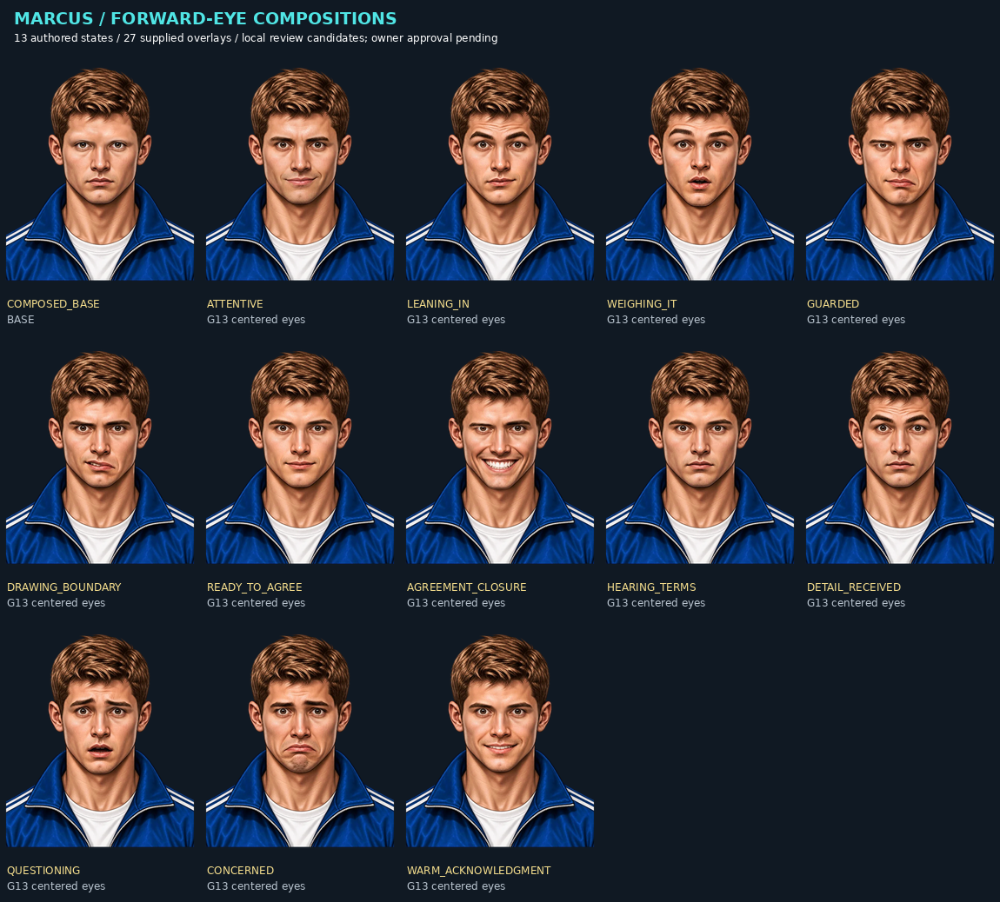

# Marcus two-beat face review

Status: locally composed and technically raster-reviewed; OWNER VISUAL APPROVAL PENDING. These revisions are candidates for the authorized local implementation, not a claim of approved production expression coverage. No new artwork, runtime generation, or closed-eye crops were added.

## Player experience and actual design

On Send, the reception beat shows Marcus taking in the action the player actually communicated. The responding beat accompanies his already-resolved reply. Selecting a draft, browsing known subjects, or changing BASED does not generate an NPC face preview. Both beats belong to one committed turn and have no authority over mechanics.

The same forward eye pair anchors twelve deliberately authored expressions; the opening uses the untouched base. The brows and mouth carry most of this first expansion. The full portrait frame includes hair, ears, chin, and shoulders. It must be rendered with contain sizing, never cover cropping.



The sheet was rendered from the same WebP bytes, placements and layer ordering as the catalog, at 220-pixel portrait width. A4 visually inspected all thirteen composites: no downward gaze or cross-eyed overlays, missing face edges, or gross layer displacement observed. A6 receives the sheet for independent inspection. This is technical raster review; it is not a first-time-player emotion-recognition study or owner aesthetic approval.

## Authored coverage

| Preset | Player-visible morphology | Implementation role |
| --- | --- | --- |
| COMPOSED_BASE | Resting brows, forward eyes, closed mouth | Opening/restart; original unmodified base |
| ATTENTIVE | Level brows and slight smile | Neutral public answer |
| LEANING_IN | Lifted brows and restrained mouth | Favorable applied public movement; original downward eyes replaced |
| WEIGHING_IT | Arched brows and rounded open mouth | Public counteroffer; original sideways eyes replaced |
| GUARDED | Flat brows and one downturned mouth corner | Public adverse movement; original narrowed eyes replaced |
| DRAWING_BOUNDARY | Uneven brow angle and tense mouth | Rejection or conversation ending; original narrowed eyes replaced |
| READY_TO_AGREE | Level brows and small closed smile | Approved live offer awaiting confirmation; original closed eyes replaced |
| AGREEMENT_CLOSURE | Low brows and broad toothy smile | Confirmed atomic agreement only; original closed eyes replaced |
| HEARING_TERMS | Level brows and unchanged neutral mouth | Generic listening/proposal reception |
| DETAIL_RECEIVED | Raised brows and unchanged neutral mouth | Hearing an explicit information-related statement or acknowledgment; no inference about truth |
| QUESTIONING | Inner brows raised and small rounded mouth | Hearing a communicated challenge; neutral priorities answer |
| CONCERNED | Sloping inner brows and closed downturned mouth | Adverse public response to debt/acknowledgment |
| WARM_ACKNOWLEDGMENT | Level brows and small toothy smile | Favorable public small-talk response |

Preset IDs are implementation labels, not guaranteed emotion diagnoses. Captions describe visible morphology. Agreement closure's broad smile has an intense brow shape inherited from the prior composition; owner review should decide whether that performance suits Marcus. Ready/attentive/hearing differences are intentionally subtle and need player readability review at the final UI size.

## Provenance and exclusion boundary

- Source: owner-supplied `marcus_face_assembler (1)(1).html`.
- Exact source SHA-256: `54cc31dd3ee5f6a710bb22ca4a49ce29462b1ffaae7c4cd626e39014eb929089`.
- Source contains 76 overlays. Local catalog includes 27 overlays plus the supplied base; every included byte has its original asset SHA-256 recorded and tested.
- Full 76-entry metadata, including excluded assets, is preserved in `src/conversation/face/source-provenance.json`. Original supplied assembler remains unmodified outside this checkout.
- The ONLY allowed eye overlays are anatomical left `2eff921f4373` and right `f1b2a234411e`, the paired centered G13 crops. Null means the original BASE feature. All other eye overlays are excluded, whether known downward, sideways, narrowed, closed, or merely not yet reviewed. They are not served or present in the runtime asset directory.
- Numeric source intensity was renamed `visualEvidenceStrength` in provenance. Source letters/codes are evidence metadata only; they never define BASED, canonical intensity, or facial policy.
- Source assembler canvas was 368.1 by 435.6 with the base at (-84.2,-27.9). New canvas is the complete base extent, 534.1 by 667.8. Base is at (0,0); every overlay gains (+84.2,+27.9). Source asset bytes are unchanged.
- Anatomical right is viewer-left. Render mouth, right eye, left eye, right brow, left brow, so brows layer above eyes.
- Repository remains UNLICENSED. No new ownership or redistribution rights are inferred.

## Policy boundaries

Reception selects only from committed intent action/topic and previous rendered state. It never reads promised information detail, exact terms, future outcome, social deltas, counterterms, BASED, intensity, raw levels, private facts, beliefs, quirk, thresholds, or dialogue text. All financial proposals receive the same initial listening preset regardless of whether they will be accepted or whether undelivered information is offered.

Response reads only action/topic, public outcome/status, existence of the current public offer, clarification-preservation flag, committed-transfer flag, and applied confidence/tension deltas. It ignores all fact IDs, detailed causes, hidden requested changes, raw metric levels and policy scores. Public terminal decisions outrank social deltas. Successful clarification retains the previous absolute face in both beats; exhausted clarification still receives normally before the public ending face.

Exactly five operations occur per beat. Reception starts from the prior response, response starts from reception. Equal target/source IDs produce HOLD; different IDs produce CHANGE. Returning to BASE is explicit. No timers or unseeded randomness participate. The engine remains responsible for authoritative event order, persistence, and rejecting forged/stale turns.

Unknown characters return an explicitly labeled BASE-only fixture snapshot (`fixture-face@1.0`, `FIXTURE_NEUTRAL`), never Marcus artwork. The noncommercial fixture proves the interface seam, not a second expressive art pack.

## Reproduction and remaining review

With the original supplied assembler available:

```sh
node src/conversation/face/import-assets.mjs /absolute/path/to/assembler.html
node --test tests/conversation-faces.test.mjs
python docs/conversation-system-v01/render-face-contact-sheet.py
```

The importer pins the source receipt and decodes only catalog-allowlisted bytes. Pillow is needed only to regenerate this documentation sheet; it is not a game dependency.

Owner review still decides the revised compositions and small-screen readability. First-time-player identification and comparison against static faces have not been run. No broad combinatorial count is presented as useful expression coverage.
